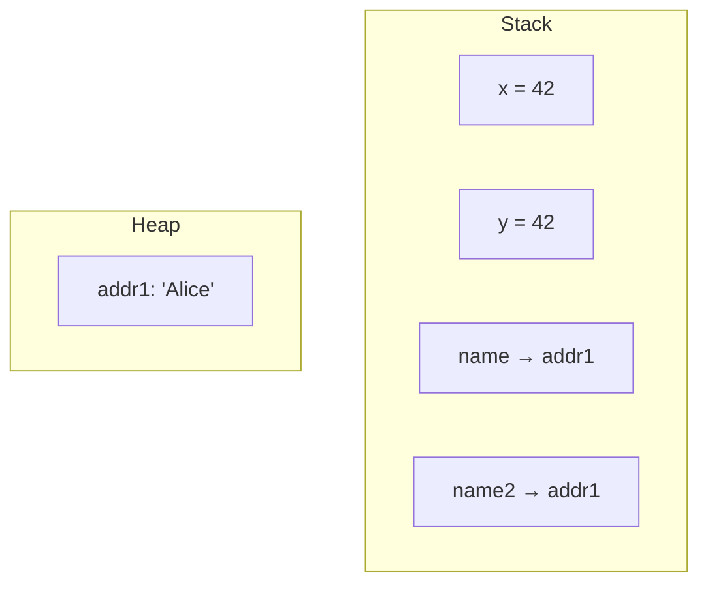

# Code Samples, Tables, and Diagrams for: Video 7: Value vs Reference Types Deep Dive

This file contains code samples, tables, and diagrams from the video.

## Slide 5: Stack vs Heap Visualized



## Slide 6: Assignment with Value Types

```csharp
int x = 10;
int y = x;  // Copy the value

Console.WriteLine($"x = {x}, y = {y}");  // x = 10, y = 10

x = 20;  // Change x

Console.WriteLine($"x = {x}, y = {y}");  // x = 20, y = 10
// y is unchanged!
```

## Slide 7: Assignment with Reference Types: The Surprise

```csharp
var list1 = new List<int> { 1, 2, 3 };
var list2 = list1;  // Copy the REFERENCE, not the list!

Console.WriteLine($"list1 count: {list1.Count}");  // 3
Console.WriteLine($"list2 count: {list2.Count}");  // 3

list1.Add(4);  // Add to list1

Console.WriteLine($"list1 count: {list1.Count}");  // 4
Console.WriteLine($"list2 count: {list2.Count}");  // 4 (!)
// list2 also has 4 items!
```

## Slide 9: Comparing Value and Reference Assignment

### Topic 1: Value Types

```csharp
int a = 5;
int b = a;  // Copy value

a = 10;  // Change a

// a = 10
// b = 5 (unchanged)
```

### Topic 2: Reference Types

```csharp
var list1 = new List<int> { 5 };
var list2 = list1;  // Copy reference

list1[0] = 10;  // Change via list1

// list1[0] = 10
// list2[0] = 10 (also changed!)
```

## Slide 10: How to Actually Copy a List

```csharp
var list1 = new List<int> { 1, 2, 3 };

// Create a NEW list with the same items
var list2 = new List<int>(list1);
// Or use LINQ
var list3 = list1.ToList();

list1.Add(4);

Console.WriteLine($"list1: {list1.Count}");  // 4
Console.WriteLine($"list2: {list2.Count}");  // 3
Console.WriteLine($"list3: {list3.Count}");  // 3
// list2 and list3 are separate copies!
```

## Slide 11: null: A Reference Type Thing

```csharp
// Reference types can be null
string name = null;  // Valid
List<int> numbers = null;  // Valid

// Value types CANNOT be null (by default)
int x = null;  // Compiler error!
bool flag = null;  // Compiler error!

// Unless you use nullable value types
int? y = null;  // Valid with ?
bool? flag2 = null;  // Valid with ?
```

## Slide 13: Method Parameters: Pass by Value

```csharp
void Increment(int x)
{
    x = x + 1;
    Console.WriteLine($"Inside: x = {x}");
}

int number = 10;
Increment(number);
Console.WriteLine($"Outside: number = {number}");

// Output:
// Inside: x = 11
// Outside: number = 10 (unchanged!)
```

## Slide 14: Method Parameters: Reference Types

```csharp
void AddItem(List<int> list)
{
    list.Add(999);
}

var myList = new List<int> { 1, 2, 3 };
AddItem(myList);
Console.WriteLine($"Count: {myList.Count}");

// Output: Count: 4
// The method DID modify myList!
```

