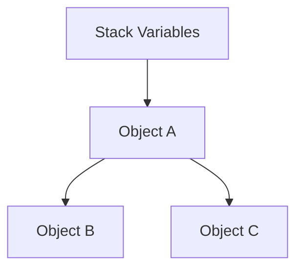

# Code Samples, Tables, and Diagrams for: Understanding Garbage Collection - Your Automatic Memory Manager

This file contains code samples, tables, and diagrams from the video.

## Slide 4: Manual Memory Management (The Old Way)

```c
// C language - manual memory management
int* numbers = malloc(100 * sizeof(int));  // Allocate

// Use the memory...
for(int i = 0; i < 100; i++) {
    numbers[i] = i;
}

free(numbers);  // YOU must remember to free!
// Forget this line = memory leak
// Call it twice = crash
```

## Slide 5: Automatic Memory Management (C# Way)

```csharp
// C# - automatic memory management
public void ProcessData()
{
    var numbers = new int[100];  // Allocate
    
    // Use the memory...
    for(int i = 0; i < 100; i++)
    {
        numbers[i] = i;
    }
    
    // No free() needed!
    // GC handles it when 'numbers' is no longer reachable
}
```

## Slide 7: How GC Finds Garbage



## Slide 9: GC in Action

```csharp
// Creating garbage for GC to collect
public void CreateGarbage()
{
    for(int i = 0; i < 10000; i++)
    {
        var person = new Person
        {
            Name = $"Person {i}",
            Age = Random.Next(100)
        };
        // 'person' goes out of scope here
        // becomes garbage immediately
    }
    // After loop: 10,000 Person objects are garbage
    // GC will collect them automatically
}
```

