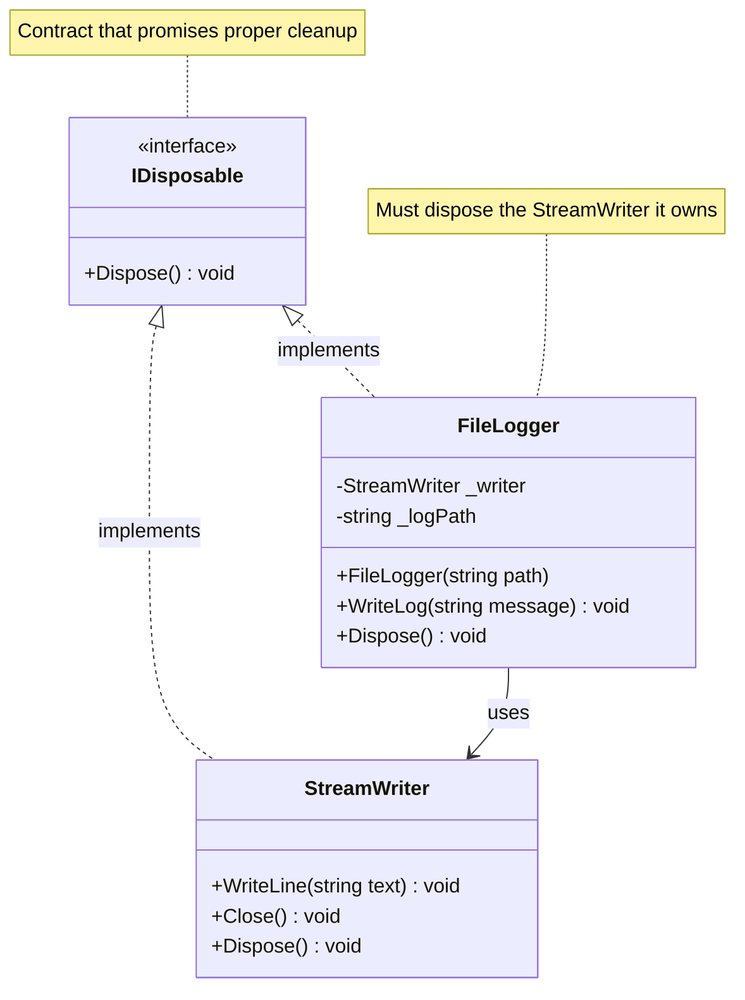

# Code Samples, Tables, and Diagrams for: Video 14: Managing Resources - The 'using' Statement

This file contains code samples, tables, and diagrams from the video.

## Slide 3: System.IDisposable



## Slide 4: The Problem: Forgetting to Close

```csharp
// DON'T DO THIS!
var writer = new StreamWriter("data.txt");
writer.WriteLine("Hello World");
// Oops, forgot to close!

// Later in your program...
var reader = new StreamReader("data.txt");
// BOOM! File is still locked!
```

## Slide 5: Manual cleanup: Try-Finally

```csharp
// The responsible but verbose way
StreamWriter? writer = null;
try
{
    writer = new StreamWriter("data.txt");
    writer.WriteLine("Hello World");
}
finally
{
    if (writer != null)
    {
        writer.Close();
        writer.Dispose();
    }
}
```

## Slide 6: The 'using' Statement

### Topic 1: Manual

```csharp
// Old verbose way
StreamWriter writer = null;
try
{
    writer = new StreamWriter("data.txt");
    writer.WriteLine("Hello");
}
finally
{
    writer?.Dispose();
}
```

### Topic 2: Using Statement

```csharp
// Clean and automatic!
using (var writer = new StreamWriter("data.txt"))
{
    writer.WriteLine("Hello");
}
// Automatically disposed here!
```

## Slide 7: Using Declaration (C# 8+)

```csharp
void SaveData(string data)
{
    // Even simpler in C# 8!
    using var writer = new StreamWriter("data.txt");
    
    writer.WriteLine(data);
    writer.WriteLine("More data");
    
    // Disposed when method ends
}
```

## Slide 10: Cleaning up Multiple Resources

### Topic 1: Nested Using

```csharp
// Nested using statements
using (var input = new StreamReader("input.txt"))
{
    using (var output = new StreamWriter("output.txt"))
    {
        string line;
        while ((line = input.ReadLine()) != null)
        {
            output.WriteLine(line.ToUpper());
        }
    }
}
```

### Topic 2: Using Declarations

```csharp
// Much cleaner with declarations!
using var input = new StreamReader("input.txt");
using var output = new StreamWriter("output.txt");

string line;
while ((line = input.ReadLine()) != null)
{
    output.WriteLine(line.ToUpper());
}
// Both disposed here
```

## Slide 12: Common Mistake #2

```csharp
// DON'T DO THIS!
public class DataProcessor
{
    private StreamWriter _writer = new StreamWriter("log.txt");
    
    public void ProcessData(string data)
    {
        _writer.WriteLine($"Processing: {data}");
        // Where's the using? When does this close?
    }
}
```

## Slide 14: Real World Example

```csharp
// Processing a CSV file properly
public List<Customer> LoadCustomers(string fileName)
{
    var customers = new List<Customer>();
    
    using var reader = new StreamReader(fileName);
    string line;
    
    // Skip header
    reader.ReadLine();
    
    while ((line = reader.ReadLine()) != null)
    {
        var parts = line.Split(',');
        customers.Add(new Customer 
        { 
            Name = parts[0], 
            Email = parts[1] 
        });
    }
    
    return customers;  // File automatically closed
}
```

