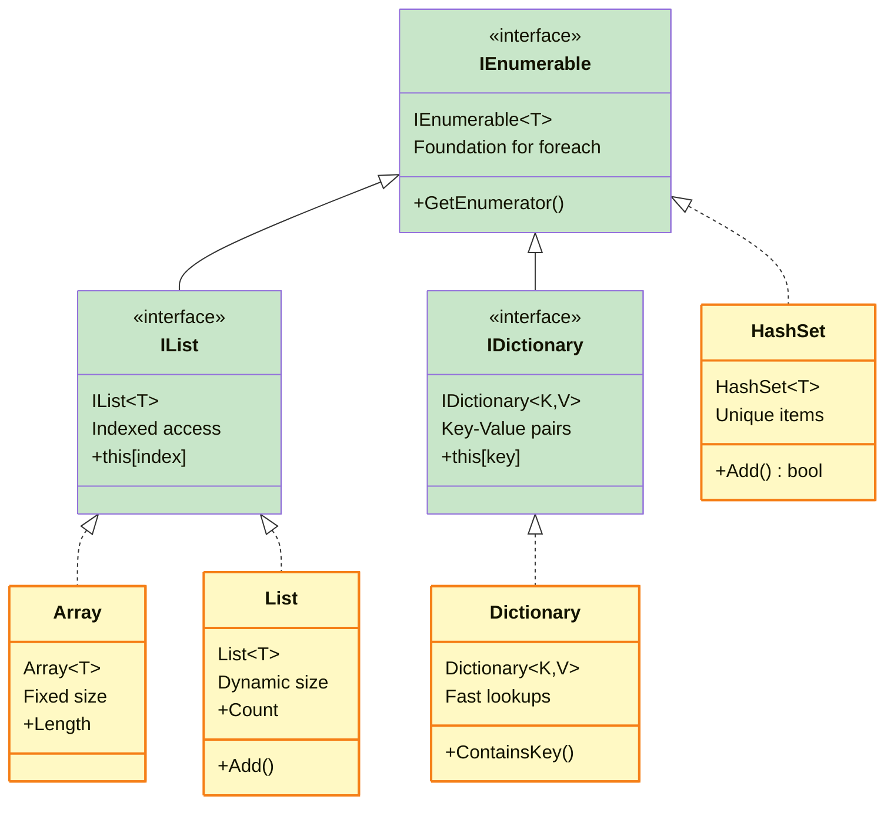

# Code Samples, Tables, and Diagrams for: Video 16: Collections - Lists and Arrays

This file contains code samples, tables, and diagrams from the video.

## Slide 2: The Problem With Single Variables

```csharp
// This gets ugly fast...
string student1 = "Alice";
int grade1 = 92;

string student2 = "Bob";
int grade2 = 87;

string student3 = "Charlie";
int grade3 = 95;

// What if you have 30 students?
// What if you need to find the highest grade?
```

## Slide 4: Arrays - Your First Collection

```csharp
// Creating an array of 5 integers
int[] grades = new int[5];
grades[0] = 92;  // First box (index 0)
grades[1] = 87;  // Second box (index 1)
grades[2] = 95;  // Third box (index 2)

// Or create with initial values
string[] students = { "Alice", "Bob", "Charlie" };

// Loop through them!
for (int i = 0; i < students.Length; i++)
{
    Console.WriteLine($"{students[i]}: {grades[i]}");
}
```

## Slide 6: Lists - Dynamic Collections

```csharp
// Creating a List
List<string> students = new List<string>();

// Add items dynamically
students.Add("Alice");
students.Add("Bob");
students.Add("Charlie");

// Or initialize with values
List<int> grades = new List<int> { 92, 87, 95 };

// Add more anytime
grades.Add(88);
students.Add("Diana");

// Remove items
students.Remove("Bob");
grades.RemoveAt(1);  // Remove by index

// Still works with foreach!
foreach (string student in students)
{
    Console.WriteLine(student);
}
```

## Slide 8: Dictionary - Key-Value Pairs

```csharp
// Dictionary<KeyType, ValueType>
Dictionary<string, int> grades = new Dictionary<string, int>();

// Add key-value pairs
grades["Alice"] = 92;
grades["Bob"] = 87;
grades["Charlie"] = 95;

// Or use Add method
grades.Add("Diana", 88);

// Look up by key - this is FAST!
int aliceGrade = grades["Alice"];  // 92

// Check if key exists first
if (grades.ContainsKey("Eve"))
{
    Console.WriteLine(grades["Eve"]);
}

// Loop through all pairs
foreach (var student in grades)
{
    Console.WriteLine($"{student.Key}: {student.Value}");
}
```

## Slide 9: HashSet - Unique Items Only

```csharp
// HashSet automatically prevents duplicates
HashSet<string> loggedInUsers = new HashSet<string>();

// Add users as they log in
loggedInUsers.Add("Alice");    // Returns true (added)
loggedInUsers.Add("Bob");      // Returns true (added)
loggedInUsers.Add("Alice");    // Returns false (already exists!)
loggedInUsers.Add("Charlie");  // Returns true (added)

Console.WriteLine(loggedInUsers.Count);  // 3, not 4!

// Super fast contains check
if (loggedInUsers.Contains("Alice"))
{
    Console.WriteLine("Alice has logged in today");
}

// Set operations!
HashSet<string> premiumUsers = new HashSet<string> { "Alice", "Diana" };
loggedInUsers.IntersectWith(premiumUsers);  // Premium users who logged in
```

## Slide 10: How Collections Fit Together



## Slide 13: Real-World Example

```csharp
// Track students and their grades
Dictionary<string, List<int>> gradeBook = new Dictionary<string, List<int>>();

// Add students with their test scores
gradeBook["Alice"] = new List<int> { 92, 88, 95 };
gradeBook["Bob"] = new List<int> { 78, 82, 85 };

// Add a new test score for Alice
gradeBook["Alice"].Add(90);

// Track who's passing (unique list)
HashSet<string> passingStudents = new HashSet<string>();

foreach (var student in gradeBook)
{
    double average = student.Value.Average();  // LINQ!
    Console.WriteLine($"{student.Key}: {average:F1}");
    
    if (average >= 70)
    {
        passingStudents.Add(student.Key);
    }
}

Console.WriteLine($"Passing: {passingStudents.Count} students");
```

